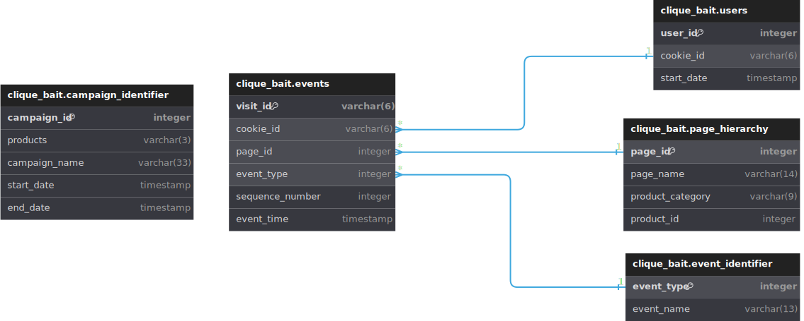

# 🪝 1. Enterprise Relationship Diagram
<p align="center">


## 📚 Table of Contents

* [Case Study Questions](#-case-study-questions)
* [My Solution](#-my-solution)
* [Case Study #6 - Clique Bait](#-case-study-6---clique-bait)

## ❓ Case Study Questions

* [Using the following DDL schema details to create an ERD for all the Clique Bait datasets.](#using-the-following-ddl-schema-details-to-create-an-erd-for-all-the-clique-bait-datasets)

## 💡 My Solution

### Using the following DDL schema details to create an ERD for all the Clique Bait datasets.

```SQL
Table clique_bait.event_identifier {
  event_type integer [primary key]
  event_name varchar(13) [unique]
}

Table clique_bait.campaign_identifier {
  campaign_id integer [primary key]
  products varchar(3)
  campaign_name varchar(33)
  start_date timestamp
  end_date timestamp
}

Table clique_bait.page_hierarchy {
  page_id integer [primary key]
  page_name varchar(14) [unique]
  product_category varchar(9)
  product_id integer [unique]
}

Table clique_bait.users {
  user_id integer [primary key]
  cookie_id varchar(6) [unique]
  start_date timestamp
}

Table clique_bait.events {
  visit_id varchar(6) [primary key]
  cookie_id varchar(6)
  page_id integer
  event_type integer
  sequence_number integer
  event_time timestamp
}


Ref: "clique_bait"."event_identifier"."event_type" < "clique_bait"."events"."event_type"

Ref: "clique_bait"."page_hierarchy"."page_id" < "clique_bait"."events"."page_id"

Ref: "clique_bait"."users"."cookie_id" < "clique_bait"."events"."cookie_id"
```



## 🪝 Case Study #6 - Clique Bait

Curious for more? Get your hands on all the sections [here](../README.md).

© 2024 [Shiv Katira](https://github.com/shivkatira)