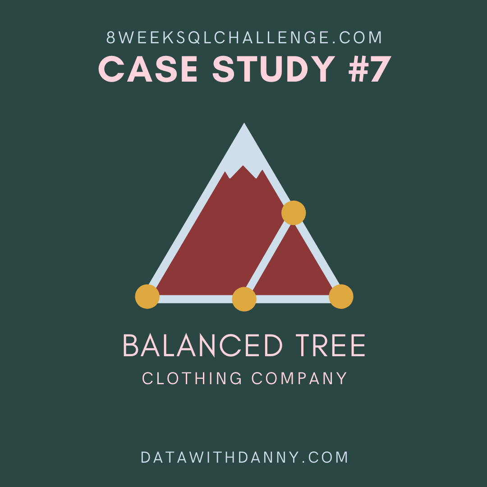

# 🏔️ Transaction Analysis
<p align="center">


## 📚 Table of Contents

* [Case Study Questions](#-case-study-questions)
* [My Solution](#-my-solution)
* [Case Study #7 - Balanced Tree Clothing Co](#️-case-study-7---balanced-tree-clothing-co)

## ❓ Case Study Questions

1. [How many unique transactions were there?](#q1-how-many-unique-transactions-were-there)
2. [What is the average unique products purchased in each transaction?](#q2-what-is-the-average-unique-products-purchased-in-each-transaction)
3. [What are the 25th, 50th and 75th percentile values for the revenue per transaction?](#q3-what-are-the-25th-50th-and-75th-percentile-values-for-the-revenue-per-transaction)
4. [What is the average discount value per transaction?](#q4-what-is-the-average-discount-value-per-transaction)
5. [What is the percentage split of all transactions for members vs non-members?](#q5-what-is-the-percentage-split-of-all-transactions-for-members-vs-non-members)
6. [What is the average revenue for member transactions and non-member transactions?](#q6-what-is-the-average-revenue-for-member-transactions-and-non-member-transactions)

## 💡 My Solution

### Q1. How many unique transactions were there?

```SQL
SELECT 
    COUNT(DISTINCT txn_id) AS unique_transactions -- Count the number of unique transactions
FROM 
    balanced_tree.sales; -- Use sales table to get transaction data
```

| unique_transactions |
| ------------------- |
| 2500                |

### Q2. What is the average unique products purchased in each transaction?

```SQL
WITH unique_prod_per_txn_cte AS (
    SELECT 
        txn_id, -- Select transaction ID
        COUNT(DISTINCT prod_id) AS unique_prod -- Count the number of unique products per transaction
    FROM 
        balanced_tree.sales -- Use sales table to get product data
    GROUP BY 
        txn_id -- Group by transaction ID to get unique product count per transaction
)
SELECT 
    ROUND(AVG(unique_prod), 2) AS avg_unique_prod -- Calculate the average number of unique products per transaction, rounded to 2 decimal places
FROM 
    unique_prod_per_txn_cte; -- Use the CTE to calculate the average
```

| avg_unique_prod |
| --------------- |
| 6.04            |

### Q3. What are the 25th, 50th and 75th percentile values for the revenue per transaction?

```SQL
WITH revenue_by_txn_cte AS (
    SELECT 
        txn_id, -- Select transaction ID
        SUM(qty * price) AS revenue -- Calculate revenue for each transaction
    FROM 
        balanced_tree.sales -- Use sales table to get transaction data
    GROUP BY 
        txn_id -- Group by transaction ID to aggregate revenue per transaction
)
SELECT 
    PERCENTILE_CONT(0.25) WITHIN GROUP (ORDER BY revenue) AS percentile_25, -- Calculate the 25th percentile for revenue
    PERCENTILE_CONT(0.50) WITHIN GROUP (ORDER BY revenue) AS percentile_50, -- Calculate the 50th percentile (median) for revenue
    PERCENTILE_CONT(0.75) WITHIN GROUP (ORDER BY revenue) AS percentile_75 -- Calculate the 75th percentile for revenue
FROM 
    revenue_by_txn_cte; -- Use the CTE to get revenue per transaction
```

| percentile_25 | percentile_50 | percentile_75 |
| ------------- | ------------- | ------------- |
| 375.75        | 509.5         | 647           |

### Q4. What is the average discount value per transaction?

```SQL
WITH discount_per_txn_cte AS (
    SELECT 
        txn_id, -- Select transaction ID
        SUM(qty * price * discount / 100.0) AS discount_per_txn -- Calculate total discount for each transaction
    FROM 
        balanced_tree.sales -- Use sales table to get transaction data
    GROUP BY 
        txn_id -- Group by transaction ID to aggregate discount per transaction
)
SELECT 
    ROUND(AVG(discount_per_txn), 2) AS avg_discount_per_txn -- Calculate the average discount per transaction and round to 2 decimal places
FROM 
    discount_per_txn_cte; -- Use the CTE to get discount per transaction
```

| avg_discount_per_txn |
| -------------------- |
| 62.49                |

### Q5. What is the percentage split of all transactions for members vs non-members?

```SQL
SELECT 
    member, -- Select membership status
    ROUND(
        COUNT(DISTINCT txn_id) * 100.0 / (
            SELECT COUNT(DISTINCT txn_id) FROM balanced_tree.sales -- Calculate the total number of unique transactions
        ), 
        2
    ) AS txn_contribution_pct -- Calculate and round the percentage of transactions for each membership status
FROM 
    balanced_tree.sales -- Use sales table to get transaction data
GROUP BY 
    member -- Group by membership status to aggregate transactions
ORDER BY 
    txn_contribution_pct DESC; -- Order by transaction percentage in descending order for better readability
```

| member | txn_contribution_pct |
| ------ | -------------------- |
| true   | 60.20                |
| false  | 39.80                |

### Q6. What is the average revenue for member transactions and non-member transactions?

```SQL
WITH 
    revenue_per_txn_cte AS (
        SELECT 
            member, -- Select membership status
            txn_id, -- Select transaction ID
            SUM(price * qty) AS revenue -- Calculate the revenue for each transaction
        FROM 
            balanced_tree.sales -- Use sales table to get transaction data
        GROUP BY 
            member, -- Group by membership status
            txn_id -- Group by transaction ID
    )
SELECT 
    member, -- Select membership status
    ROUND(AVG(revenue), 2) AS avg_revenue -- Calculate and round the average revenue per transaction
FROM 
    revenue_per_txn_cte -- Use CTE to get revenue per transaction
GROUP BY 
    member -- Group results by membership status
ORDER BY 
    avg_revenue DESC; -- Order by average revenue in descending order for better readability
```

| member | avg_revenue |
| ------ | ----------- |
| true   | 516.27      |
| false  | 515.04      |

## 🏔️ Case Study #7 - Balanced Tree Clothing Co

Curious for more? Get your hands on all the sections [here](../README.md).

© 2024 [Shiv Katira](https://github.com/shivkatira)